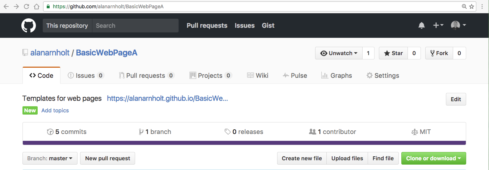
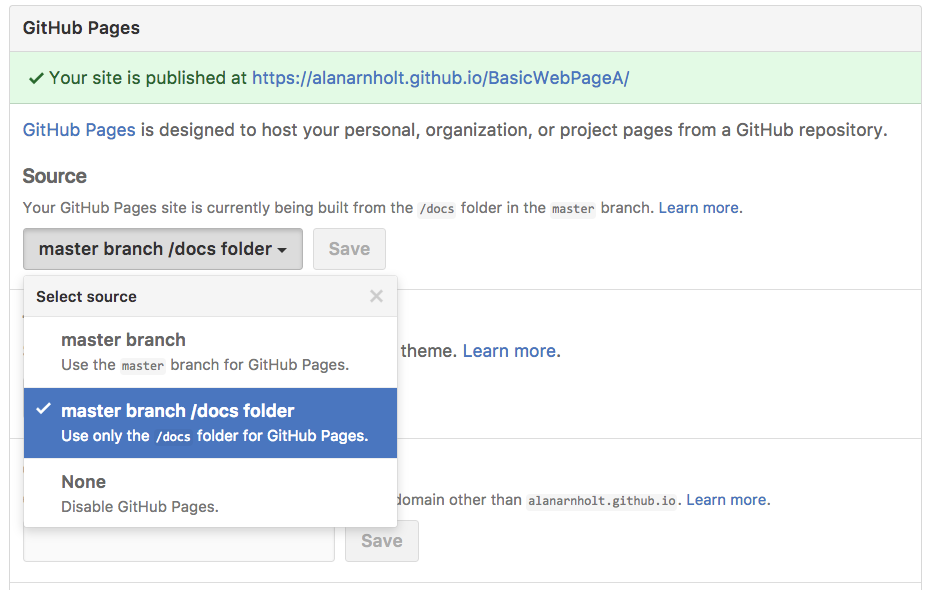
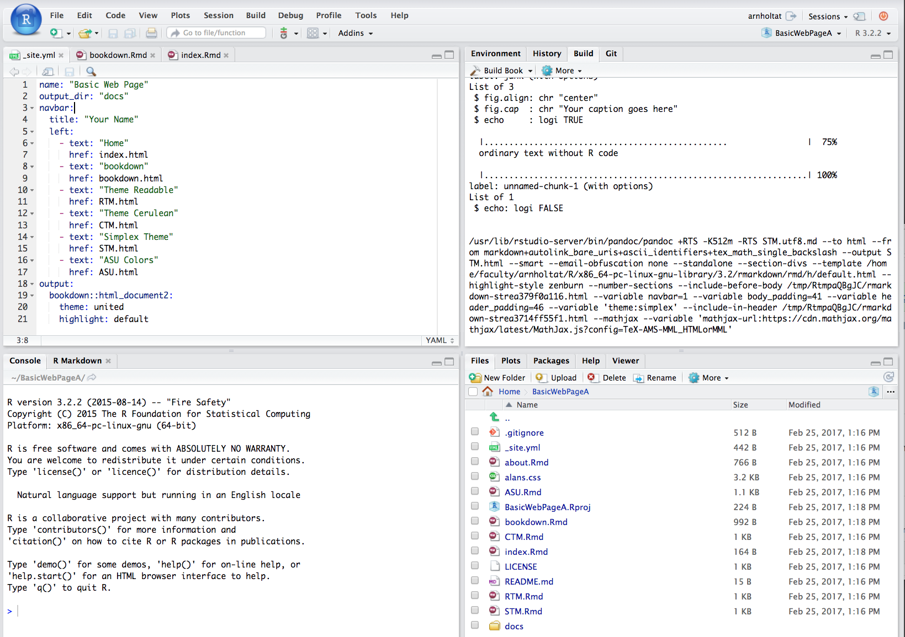

```{r setup, include=FALSE}
library(knitr)
knitr::opts_chunk$set(echo = FALSE, comment = NA)
```

## Prerequisites

This talk assumes you have the following installed on your machine:

* `R` (https://cran.r-project.org/) 
* `RStudio` (https://www.rstudio.com/)
* `Git` (https://git-scm.com/)

or that you have access to the ASU [RStudio server](https://mathr.math.appstate.edu/auth-sign-in) that has all of the above and more already installed.

**Note:** If you are a MAC user, I recommend using the version of `Git` that is pre-installed with Xcode (https://developer.apple.com/xcode/).  See the Mac OS section of [Happy Git and GitHub for the userR](http://happygitwithr.com/install-git.html#mac-os) for details.


## Tips/Checks

To see the version of `Git` installed on your machine, open a shell and type: 

```{r, label = "version", engine = "bash", echo = TRUE}
git --version
```

To find out where `Git` is installed on your machine, open a shell and type:

```{r, label = "which", engine = "bash", echo = TRUE}
which git
```

## Make Sure `Git` Knows Who You Are

Type the following at the shell prompt:

```{r label = "who", engine = "bash", echo = TRUE}
git config --global --list
```

If you have not configured at a minimum your `user.name` and `user.email`, substitute your name and email for mine in the code below.

```{r, label = "youme", engine = "bash", echo = TRUE, eval = FALSE}
git config --global user.name 'Alan Arnholt'
git config --global user.email 'arnholtat@appstate.edu'
```

      


## Create a [GitHub](https://github.com/) Account

* Username advice

* Sign up (https://github.com/)

* Request a student discount (https://education.github.com/)


## Fork [BasicWebPageA](https://github.com/alanarnholt/BasicWebPageA)


* Point your browser to https://github.com/alanarnholt/BasicWebPageA

* Fork [BasicWebPageA](https://github.com/alanarnholt/BasicWebPageA) 

* Clone your fork of [BasicWebPageA](https://github.com/alanarnholt/BasicWebPageA) to your local machine

* [R Markdown Websites Documentation](http://rmarkdown.rstudio.com/rmarkdown_websites.html)

## Understanding the Set Up

The website created from the code in the repo [BasicWebPageA](https://github.com/alanarnholt/BasicWebPageA) and viewable at https://alanarnholt.github.io/BasicWebPageA/ consists of `*.yml` and `*.Rmd` files.  The minimum requirement for any website is that it have an `index.Rmd` file as well as a `_site.yml` file.  Consider the first nine lines of the `_site.yml` file.

```{r, eval = FALSE, echo = TRUE}
name: "Basic Web Page"
output_dir: "docs"
navbar:
  title: "Your Name"
  left:
    - text: "Home"
      href: index.html
    - text: "bookdown"
      href: bookdown.html
```

## Publishing on GitHub

There are several ways to publish your web pages on GitHub.  For now, we will only consider publishing the `docs` directory.  To publish the `docs` directory, choose the Settings icon on your GitHub repository.

```{r, echo = FALSE}

```

## GitHub Pages

Scroll down to the **GitHub Pages** box.  Click on the drop down menu under **Source** and select **master branch /docs folder**

```{r, echo = FALSE}

```

## Building the Web Pages

```{r, echo = FALSE}

```